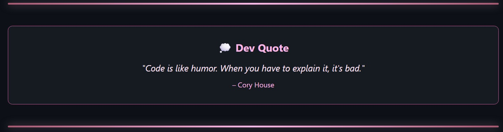

  

  

  

  <h2>𖹭.ᐟ Índice</h2>

  

    •<a href="#about-me"> About Me</a> 
    •<a href="#tech-stack-tools"> Tech Stack & Tools</a> 
    •<a href="#github-statistics"> GitHub Statistics</a> 
    •<a href="#current-projects"> Current Projects</a> 
    •<a href="#what-im-up-to"> What I'm up to</a> 
    •<a href="#support-my-work"> Support My Work</a>
  

  

    <h2 id="about-me">𖹭.ᐟ About Me</h2>
    

      Hi, I'm <b>Laís Moraes</b>. 👋  
      Full Stack Developer | Creative Coder | Tech Enthusiast  
      I enjoy solving complex problems, designing clean architectures, and delivering products that balance engineering excellence and user experience.  
      I value simplicity, performance, and clarity in both code and communication.
    

  

  

  <h2 id="tech-stack-tools">𖹭.ᐟ Tech Stack & Tools</h2>

  <h3>Frontend</h3>
  

    
    
    
    
    
    
    
    
  

  <h3>Backend</h3>
  

    
    
    
    
    
  

  <h3>Database & Cloud</h3>
  

    
    
    
    
    
    
  

  <h3>Tools</h3>
  

    
    
    
    
  

  

  <h2 id="github-statistics">𖹭.ᐟ GitHub Statistics</h2>

  
  

  

  <h2 id="current-projects">𖹭.ᐟ Current Projects</h2>

  

  

  

  <h2 id="what-im-up-to">𖹭.ᐟ What I'm up to</h2>

  

    Languages: JavaScript · TypeScript · Python  
    Frontend: React · Next.js · Vue  
    Backend: Node.js · Express · Django  
    Data & Cloud: PostgreSQL · MongoDB · AWS · Docker  
    Tools: Git · CI/CD · Agile  
    Currently Exploring: AI Engineering · Machine Learning · System Design  
    Engineering Principles: Clean code · Scalability · Performance · Continuous learning  
    <h2>⟢ Open to collaboration, impactful projects, and global opportunities.</h2>  
  

  

 
 

 

  

 
<h2> 𖹭.ᐟ Support My Work</h2> 
If you like my work, consider supporting me:    
   

 
  

 
  Made with 💖 and lots of ☕ <b>by 𝐿𝑎𝜄́𝑠 𝑀𝑜𝑟𝑎𝑒𝑠.</b>
  
    

