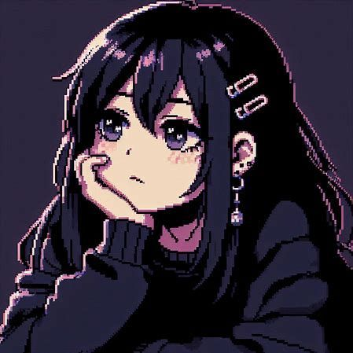

<!-- HEADER / BANNER -->

  

<!-- PROFILE CONTENT -->

  <!-- Avatar -->
  

  <!-- Welcome -->
  <h1>
    Welcome to my GitHub Profile!
  </h1>

  <!-- Komarev Badge -->
  

    

  <!-- About Me Card -->
  

    <h2>
      ♡ About Me
    </h2>
    

      Hi, I'm Laís Moraes.  
      Full Stack Developer | Creative Coder | Tech Enthusiast  
      I enjoy solving complex problems, designing clean 
      architectures, and delivering products that balance 
      engineering excellence and user experience.  
      I value simplicity, performance, and clarity | 
      in both code and communication.  
      hobbies: ["Coding", 
               "Gaming", 
               "Reading"], 
      motto: "Code is poetry ✨"
    

  

